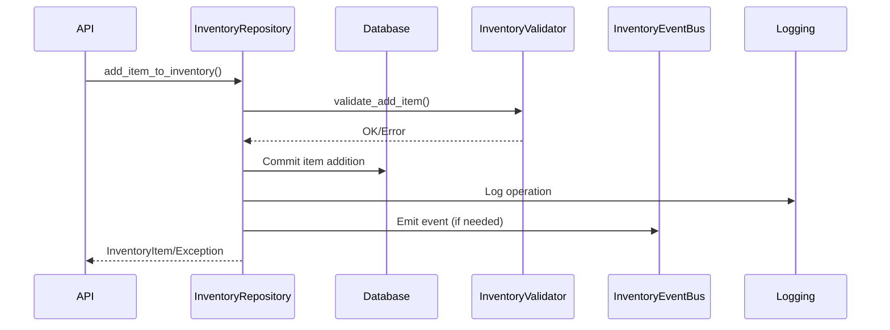

# API Reference and Integration Points

## Table of Contents
1. [Overview](#overview)
2. [Public API Methods](#public-api-methods)
3. [Exception Handling](#exception-handling)
4. [Authentication and Authorization](#authentication-and-authorization)
5. [Data Flow Diagrams](#data-flow-diagrams)
6. [Event Bus Integration](#event-bus-integration)
7. [Query Interface](#query-interface)
8. [References](#references)

---

## Overview
This section documents the public API surface of the inventory management system, including method signatures, parameters, return values, and integration points with other systems.

## Public API Methods

### InventoryRepository
- `create_inventory(owner_id, owner_type, capacity=None, weight_limit=None) -> Inventory`
- `add_item_to_inventory(inventory_id, item_id, quantity=1, position=None, is_equipped=False) -> InventoryItem`
- `remove_item_from_inventory(inventory_item_id) -> bool`
- `batch_add_items(inventory_id, items: List[Tuple[item_id, quantity]]) -> List[InventoryItem]`
- `batch_remove_items(inventory_item_ids: List[int]) -> bool`
- `transfer_item(source_inventory_id, target_inventory_id, item_id, quantity=1) -> bool`
- `backup_inventories(backup_path) -> str`
- `restore_inventories(backup_path) -> str`
- `rotate_backups(backup_dir, max_backups=5) -> bool`

### InventoryContainer
- `add_item(item, quantity=1) -> InventoryItem`
- `remove_item(item_id, quantity=1) -> bool`
- `split_stack(item_id, split_quantity) -> InventoryItem`
- `combine_stacks(item_id) -> None`
- `transfer_item(target_container, item_id, quantity=1) -> bool`
- `is_full() -> bool`
- `is_overweight(extra_weight=0) -> bool`

### InventoryValidator
- `validate_add_item(container, item, quantity) -> None`
- `validate_remove_item(container, item_id, quantity) -> None`
- `validate_transfer_item(source_container, target_container, item_id, quantity) -> None`
- `validate_update_item(container, item_id, new_quantity) -> None`

### RecoveryManager
- `detect_inconsistencies() -> List[dict]`
- `fix_inconsistencies(auto_fix=True) -> dict`
- `recover_inventory(backup_path) -> str`

### InventoryEventBus
- `subscribe(event_type, callback) -> None`
- `emit(event_type, **kwargs) -> None`

### InventoryQueryInterface
- `get_inventory_by_user(user_id) -> List[dict]`
- `get_item_history(item_id) -> List[str]`
- `get_inventory_snapshot(inventory_id) -> dict`

## Exception Handling
- All validation errors raise `InventoryValidationError` with error code and message.
- Repository methods may raise standard database exceptions on connection or commit failure.
- RecoveryManager methods may raise exceptions if backup/restore fails.

## Authentication and Authorization
- API methods should be called from authenticated contexts (e.g., game server, trusted backend).
- Authorization checks should be implemented at the API layer to ensure only permitted users can modify or access inventories.
- Query interface methods are read-only and should enforce permission checks for sensitive data.

## Data Flow Diagrams

## Event Bus Integration
- **Events:**
  - `item_value_change`: Emitted on item value update
  - `significant_event`: Emitted for rare item acquisition, large transactions, item destruction
- **Usage:**
  - `InventoryEventBus.subscribe('item_value_change', callback)`
  - `InventoryEventBus.emit('significant_event', event='rare_item_acquired', inventory_id=..., item_id=..., user_id=..., details=...)`
- **Integration:**
  - Economic Agent and Reputation systems should subscribe to relevant events for real-time updates

## Query Interface
- **get_inventory_by_user(user_id):** Returns all inventories for a user as a list of dicts
- **get_item_history(item_id):** Returns log entries for a specific item
- **get_inventory_snapshot(inventory_id):** Returns a snapshot of inventory state
- **Thread Safety:** All query methods are protected by a reentrant lock

## References
- [System Architecture](system-architecture.md)
- [Core Components and Class Structure](core-components.md)
- [Usage Examples and Best Practices](usage-examples.md)
- [Testing Strategy and Documentation Index](testing.md)
