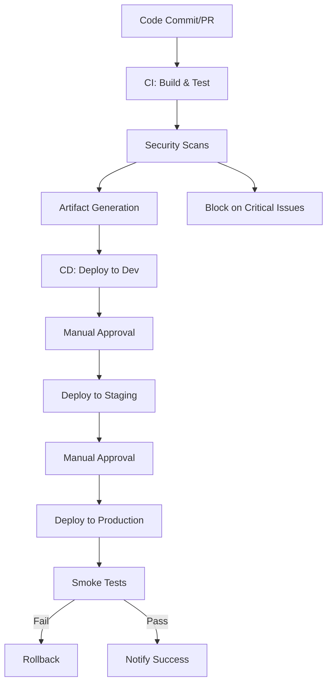

# CI/CD Architecture for Visual DM

## Overview
This document describes the CI/CD pipeline architecture for the Visual DM project, covering all stages from code commit to deployment, including security, compliance, and monitoring. The pipeline is implemented using GitHub Actions and follows industry best practices for reliability, security, and maintainability.

---

## 1. Pipeline Stages

### Continuous Integration (CI)
- **Source Checkout**: Uses `actions/checkout` to pull the latest code.
- **Dependency Installation**: Installs dependencies for Python (pip), Node.js (npm), and C# (NuGet) with caching.
- **Build Process**: Runs build scripts for backend (Python), frontend (Node.js), and Unity client (C#).
- **Testing**: Executes unit, integration, and end-to-end tests:
  - Python: `pytest`, coverage
  - Node.js: `jest`, type checks
  - Unity: `game-ci/unity-test-runner`
- **Code Quality**: Runs linters (`flake8`, `eslint`, `dotnet-format`) and static analysis (`bandit`, `SonarCloud`).
- **Artifact Generation**: Stores build outputs and test coverage as pipeline artifacts.

### Continuous Deployment (CD)
- **Environment Deployment**: Deploys to dev, staging, and production using AWS ECS and Docker images.
- **Configuration Management**: Injects environment variables and secrets using GitHub Actions Environments and encrypted secrets.
- **Database Migrations**: Runs migration scripts before deployment, ensuring idempotency and rollback support.
- **Smoke Testing**: Runs automated smoke tests post-deployment to verify service health.
- **Rollback Procedures**: Supports automatic and manual rollback on failed deployments.
- **Artifact Promotion**: Uses identical build artifacts across environments for consistency.

### Security & Compliance
- **Dependency Scanning**: Uses Snyk and OWASP Dependency Check for Python, Node.js, and C#.
- **Container Scanning**: Uses Trivy for Docker images.
- **Static Code Analysis**: Uses Bandit, SonarCloud, and ESLint security plugins.
- **Secret Detection**: Uses GitHub secret scanning, truffleHog, and pre-commit hooks.
- **Thresholds**: Blocks builds on high/critical vulnerabilities.

### Monitoring & Documentation
- **Pipeline Monitoring**: Uses GitHub Actions Insights, with optional Grafana/Prometheus for self-hosted runners.
- **Metrics Collection**: Tracks build times, test pass rates, deployment frequency, and failure causes.
- **Alerting**: Integrates with Slack and email for real-time notifications.
- **Documentation Generation**: Automates API docs (Swagger/OpenAPI), changelogs (conventional-changelog), and release notes.

---

## 2. Environment Specifications
- **Development**: Fast feedback, permissive settings, auto-deploy on push.
- **Staging**: Mirrors production, requires manual approval, full test suite.
- **Production**: Restricted, manual approval, comprehensive monitoring.
- **Secrets**: Managed via GitHub Environments, never committed to repo.

---

## 3. Approval Gates
- **Code Review**: Required for all merges to main.
- **Manual Approval**: Required for staging and production deployments.
- **Automated Quality Gates**: Tests, linting, and security scans must pass before deployment.

---

## 4. Notification System
- **Slack**: Real-time build and deployment status updates.
- **Email**: Critical pipeline failures and required approvals.
- **Escalation**: Progressive alerting for sustained failures.

---

## 5. Security & Compliance
- **Audit Logging**: All pipeline actions are logged.
- **Artifact Retention**: Artifacts are stored for compliance and rollback.
- **Secret Management**: Encrypted secrets, pre-commit hooks, and secret scanning.

---

## 6. Diagrams

---

## 6. Unity Client CI Workflow

### Overview
The Unity Client CI workflow ensures code quality and maintainability for the Unity 2D client. It is triggered on pushes and pull requests to the main branch affecting the UnityClient directory or the workflow file itself.

### Pipeline Steps
- **Source Checkout**: Uses `actions/checkout` to pull the latest code.
- **.NET Setup**: Installs the required .NET SDK for C# analysis tools.
- **Static Analysis**: Runs `unity-lint` on all C# scripts in `Assets/Scripts/` to enforce code standards and catch issues early.
- **Artifact Upload**: Lint results are always uploaded as artifacts for review, regardless of job success or failure.

### Concurrency
- The workflow uses a concurrency group (`unity-client-ci-${{ github.ref }}`) to ensure only one run per branch is active at a time, cancelling in-progress runs if a new commit is pushed.

### Notifications
- On failure, a notification job is triggered. This is currently a placeholder for Slack/email integration, as described in this document. Maintainers should implement integration with the team's preferred notification system.

### Documentation Reference
- For maintainers: See `.github/workflows/unity-client.yml` for the full workflow definition and update this documentation if the workflow changes.

---

## 7. Documentation & Review
- This document is versioned with the codebase.
- Pipeline YAMLs are stored in `.github/workflows/`.
- All changes are reviewed by team leads before finalization.

---

## 8. References
- [CI Pipeline YAML](../.github/workflows/ci.yml)
- [CI/CD Pipeline YAML](../.github/workflows/ci-cd.yml)
- [Unity Client CI YAML](../.github/workflows/unity-client.yml)
- [DEPLOYMENT.md](DEPLOYMENT.md)
- [SECURITY.md](SECURITY.md)

---

_Last updated: $(date)_ 