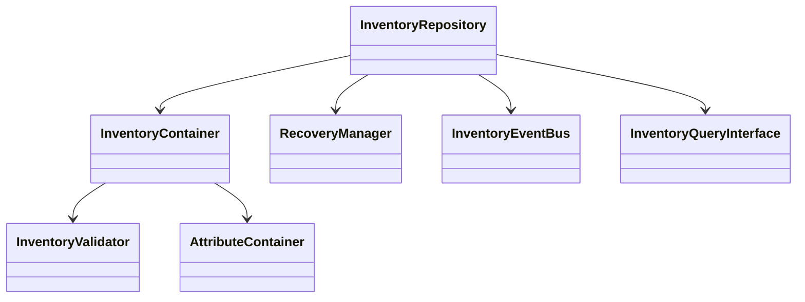

# Core Components and Class Structure

## Table of Contents
1. [Overview](#overview)
2. [Class Hierarchy Diagram](#class-hierarchy-diagram)
3. [Key Classes and Modules](#key-classes-and-modules)
    - [InventoryRepository](#inventoryrepository)
    - [InventoryContainer](#inventorycontainer)
    - [InventoryValidator](#inventoryvalidator)
    - [RecoveryManager](#recoverymanager)
    - [InventoryEventBus](#inventoryeventbus)
    - [Logging Framework](#logging-framework)
    - [InventoryQueryInterface](#inventoryqueryinterface)
    - [AttributeContainer](#attributecontainer)
4. [Interfaces and Extension Points](#interfaces-and-extension-points)
5. [Code Snippets](#code-snippets)
6. [References](#references)

---

## Overview
This section details the core classes and modules that make up the inventory management system, describing their responsibilities, relationships, and extension points.

## Class Hierarchy Diagram


## Key Classes and Modules

### InventoryRepository
- **Responsibility:** Main entry point for all inventory CRUD and transactional operations. Handles persistence, batch operations, and coordination with other components.
- **Key Methods:** `create_inventory`, `add_item_to_inventory`, `remove_item_from_inventory`, `batch_add_items`, `transfer_item`, `backup_inventories`, `restore_inventories`
- **Extension:** Add new repository methods for custom operations.

### InventoryContainer
- **Responsibility:** Encapsulates inventory logic, including size/weight limits, stacking, slotting, and item transfer. Maintains in-memory state for operations.
- **Key Methods:** `add_item`, `remove_item`, `split_stack`, `combine_stacks`, `transfer_item`, `is_full`, `is_overweight`
- **Extension:** Subclass for specialized inventory types (e.g., NPC, player, container).

### InventoryValidator
- **Responsibility:** Validates all inventory operations for input correctness, state integrity, and business rules. Raises `InventoryValidationError` on failure.
- **Key Methods:** `validate_add_item`, `validate_remove_item`, `validate_transfer_item`, `validate_update_item`
- **Extension:** Add new validation rules or override for custom logic.

### RecoveryManager
- **Responsibility:** Detects and fixes data inconsistencies, manages backup/restore, and provides recovery utilities.
- **Key Methods:** `detect_inconsistencies`, `fix_inconsistencies`, `recover_inventory`
- **Extension:** Add new recovery/fix strategies as needed.

### InventoryEventBus
- **Responsibility:** Observer/event bus for integration with external systems (e.g., economic, reputation). Allows subscription and emission of inventory-related events.
- **Key Methods:** `subscribe`, `emit`
- **Extension:** Add new event types or integrate with external event systems.

### Logging Framework
- **Responsibility:** Captures all critical inventory operations and state changes. Supports file/console output, log rotation, and structured metadata.
- **Key Methods:** Standard Python logging API (`info`, `error`, etc.)
- **Extension:** Add new log handlers or formats as needed.

### InventoryQueryInterface
- **Responsibility:** Provides thread-safe, read-only access to inventory data and operation history for external systems.
- **Key Methods:** `get_inventory_by_user`, `get_item_history`, `get_inventory_snapshot`
- **Extension:** Add new query/filter methods for additional use cases.

### AttributeContainer
- **Responsibility:** Encapsulates item attributes, supporting inheritance, composition, validation, and (de)serialization.
- **Key Methods:** `get`, `set`, `validate`, `to_dict`, `from_dict`
- **Extension:** Add new attribute types or validation logic.

## Interfaces and Extension Points
- All major classes are designed for subclassing and extension.
- Event bus allows new event types and external system integration.
- AttributeContainer supports custom attribute schemas.
- Repository and validator can be extended for new business rules.

## Code Snippets
```python
# Example: Adding an item to an inventory
inv = InventoryRepository.create_inventory(owner_id=1, owner_type='player')
item = ...  # Fetch or create item
InventoryRepository.add_item_to_inventory(inv.id, item.id, quantity=5)

# Example: Validating and transferring items
InventoryValidator.validate_transfer_item(source_container, target_container, item_id, quantity)
InventoryRepository.transfer_item(source_id, target_id, item_id, quantity)

# Example: Subscribing to events
InventoryEventBus.subscribe('item_value_change', lambda **kwargs: print('Value changed:', kwargs))

# Example: Querying inventory data
snapshots = InventoryQueryInterface.get_inventory_by_user(user_id=1)
```

## References
- [System Architecture](system-architecture.md)
- [API Reference and Integration Points](api-reference.md)
- [Usage Examples and Best Practices](usage-examples.md)
- [Testing Strategy and Documentation Index](testing.md)
