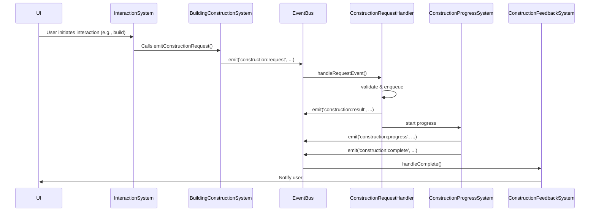

# Interaction System ↔ Building Modification/Construction Systems: Dependency & Data Flow Map

**Document ID:** DEP-IS-BC-001
**Last Updated:** 2025-05-16

---

## 1. Overview
This document details all dependencies, integration points, data exchange mechanisms, and event triggers between the Interaction System and the Building Modification/Construction Systems. It is intended to ensure proper interoperability, traceability, and maintainability.

---

## 2. Direct Code Dependencies

| Dependency ID | Source System/Class | Target System/Class | File(s) | Description |
|--------------|--------------------|--------------------|---------|-------------|
| DEP-IS-BC-001 | BuildingSystem | BuildingConstructionSystem | `src/systems/BuildingSystem.ts` | BuildingSystem composes and delegates construction operations to BuildingConstructionSystem. |
| DEP-IS-BC-002 | BuildingSystem | BuildingModificationSystem | `src/systems/BuildingSystem.ts` (if present) | (If present) BuildingSystem may delegate modification operations. |
| DEP-IS-BC-003 | ConstructionRequestSystem | BuildingConstructionSystem | `app/frontend/src/systems/ConstructionRequestSystem.ts` | Handles construction requests and delegates to BuildingConstructionSystem. |
| DEP-IS-BC-004 | BuildingConstructionSystem | EventBus | `app/frontend/src/systems/BuildingConstructionSystem.ts` | Emits construction request events for event-driven integration. |

---

## 3. Indirect Dependencies (Shared Services/Utilities)

- **EventBus** (`app/frontend/src/core/interfaces/types/events.ts`):
  - Used for event-driven communication between systems (e.g., construction requests, progress, validation errors).
- **UUID Generation** (`uuid`):
  - Used for unique IDs in building elements and requests.

---

## 4. Data Structures & Formats

- **InteractionContext** (`src/systems/npc/InteractionSystem.ts`):
  - Used for all NPC interactions, may include building-related context in `data` or `location` fields.
- **BuildingModification** (`src/systems/BuildingModificationSystem.ts`):
  - Structure for modifications (add/remove/modify) to buildings.
- **ConstructionRequest** (`app/frontend/src/systems/ConstructionRequestSystem.ts`):
  - Structure for construction requests, including player, type, position, material, etc.
- **BuildingStructure, BuildingElement, Wall, Door, Window** (`src/core/interfaces/types/building.ts`):
  - Core building data models.

**Serialization:**
- All data exchanged via events or API is serialized as JSON.
- IDs are UUID strings.

---

## 5. Validation & Error Handling

- **Validation**
  - ConstructionValidator (`app/frontend/src/systems/ConstructionRequestSystem.ts`):
    - Checks permissions, resources, placement, and custom rules.
  - BuildingModificationSystem: Validates modification type, required fields, and specific rules for add/remove/modify.
- **Error Handling**
  - Errors are reported via event emission (e.g., `construction:validationError`, `construction:result` with status `failed`).
  - All errors are logged to console and/or UI notification systems.

---

## 6. Event-Driven Integration Points

| Event Name | Source | Listener(s) | Payload/Data | Description |
|------------|--------|-------------|-------------|-------------|
| `construction:request` | BuildingConstructionSystem (via static emit) | ConstructionRequestHandler | `{ request, structure, player, resourceCheck, permissionCheck }` | Initiates a construction request. |
| `construction:result` | ConstructionRequestHandler | UI, feedback systems | `{ requestId, status, errors?, structure? }` | Reports result of construction request. |
| `construction:progress` | ConstructionProgressSystem | UI, feedback systems | `{ buildingId, progress, ... }` | Reports progress of ongoing construction. |
| `construction:validationError` | ConstructionRequestHandler | UI | `{ buildingId, errors, ... }` | Reports validation errors. |
| `construction:complete` | ConstructionFeedbackSystem | UI | `{ buildingId, ... }` | Signals construction completion. |

---

## 7. Sequence Diagram: Construction Request Flow

---

## 8. Unique Identifiers for Integration Points

- **DEP-IS-BC-001**: BuildingSystem → BuildingConstructionSystem
- **DEP-IS-BC-002**: BuildingSystem → BuildingModificationSystem
- **DEP-IS-BC-003**: ConstructionRequestSystem → BuildingConstructionSystem
- **DEP-IS-BC-004**: BuildingConstructionSystem → EventBus

---

## 9. Validation & Error Handling Procedures

- All requests are validated before processing. Invalid requests emit `construction:validationError`.
- Errors during processing emit `construction:result` with status `failed` and error details.
- All errors are logged and surfaced to the UI for user feedback.

---

## 10. Performance Considerations

- Event-driven architecture decouples UI and backend, allowing for async processing and batching.
- Construction queue ensures requests are processed in order and can be throttled for performance.
- All data structures are designed for immutability and safe concurrent access.

---

## 11. Version Compatibility

- All event payloads and data structures are versioned via TypeScript interfaces.
- Backward compatibility is maintained by extending interfaces and using optional fields.

---

## 12. Example Integration Scenario

**Scenario:** Player initiates a wall construction via UI interaction.

1. UI triggers an interaction handled by `InteractionSystem`.
2. `InteractionSystem` calls `BuildingConstructionSystem.emitConstructionRequest()` with a `ConstructionRequest`.
3. `EventBus` emits `construction:request` event.
4. `ConstructionRequestHandler` validates and enqueues the request.
5. On success, emits `construction:result` with status `queued` or `completed`.
6. `ConstructionProgressSystem` tracks and emits progress events.
7. `ConstructionFeedbackSystem` listens for completion and notifies the UI.

---

## 13. Glossary

- **Interaction System**: Handles all NPC and player interactions, including those that may trigger building actions.
- **BuildingModificationSystem**: Manages modifications (add/remove/modify) to building structures.
- **BuildingConstructionSystem**: Handles construction logic, validation, and integration with the event system.
- **EventBus**: Central event dispatcher for decoupled communication.
- **ConstructionRequestSystem**: Handles queuing, validation, and processing of construction requests.

---

## 14. References
- `src/systems/npc/InteractionSystem.ts`
- `src/systems/BuildingSystem.ts`
- `src/systems/BuildingModificationSystem.ts`
- `src/systems/BuildingConstructionSystem.ts`
- `app/frontend/src/systems/ConstructionRequestSystem.ts`
- `app/frontend/src/core/interfaces/types/events.ts`
- `app/frontend/src/systems/BuildingConstructionSystem.ts`
- `app/frontend/src/systems/ConstructionFeedbackSystem.ts`
- `app/frontend/src/systems/ConstructionProgressSystem.ts`

---

*End of document.* 