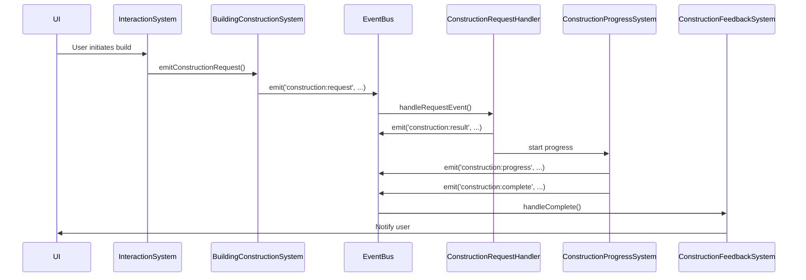

# Event Catalog: Interaction System ↔ Building Modification/Construction Systems

**Document ID:** EVT-IS-BC-001
**Last Updated:** 2025-05-16

---

## 1. Overview
This catalog documents all event triggers and communication patterns between the Interaction System and the Building Modification/Construction Systems, including both user-initiated and system-initiated events. It is intended to ensure traceability, maintainability, and robust integration.

---

## 2. Event Documentation Format
For each event:
- **Event Name/Identifier**
- **Type**: User-initiated or System-initiated
- **Sender**
- **Receiver(s)**
- **Payload Structure**
- **Expected Behavior**
- **Error Handling**

---

## 3. Event Catalog

### 3.1 User-Initiated Events

| Event Name              | Type           | Sender                    | Receiver(s)                | Payload Structure                                                                 | Expected Behavior                                                                 | Error Handling                                      |
|------------------------|----------------|---------------------------|----------------------------|-----------------------------------------------------------------------------------|-----------------------------------------------------------------------------------|-----------------------------------------------------|
| `construction:request` | User-initiated | BuildingConstructionSystem (via static emit) | ConstructionRequestHandler (via EventBus) | `{ request: ConstructionRequest, structure: BuildingStructure, player: PlayerState, resourceCheck: fn, permissionCheck: fn }` | Initiates a construction request. Validates, enqueues, and processes the request. | Emits `construction:result` with status `invalid` or `failed` and error details. |

### 3.2 System-Initiated Events

| Event Name                    | Type             | Sender                        | Receiver(s)                | Payload Structure                                                                 | Expected Behavior                                                                 | Error Handling                                      |
|------------------------------|------------------|-------------------------------|----------------------------|-----------------------------------------------------------------------------------|-----------------------------------------------------------------------------------|-----------------------------------------------------|
| `construction:result`        | System-initiated | ConstructionRequestHandler     | UI, feedback systems       | `{ requestId: string, status: ConstructionRequestStatus, errors?: string[], structure?: BuildingStructure }` | Reports result of construction request.                                             | UI displays errors or success.                      |
| `construction:progress`      | System-initiated | ConstructionProgressSystem     | UI, feedback systems       | `{ buildingId: string, progress: ConstructionProgress, ... }`                      | Reports progress of ongoing construction.                                            | UI displays progress.                              |
| `construction:validationError` | System-initiated | ConstructionRequestHandler     | UI                         | `{ buildingId: string, errors: string[], ... }`                                    | Reports validation errors.                                                            | UI displays errors.                                |
| `construction:complete`      | System-initiated | ConstructionFeedbackSystem     | UI                         | `{ buildingId: string, ... }`                                                      | Signals construction completion.                                                      | UI displays completion notification.                |

---

## 4. Event Propagation Paths

- **User triggers construction via UI → InteractionSystem → BuildingConstructionSystem.emitConstructionRequest() → EventBus emits `construction:request` → ConstructionRequestHandler validates and enqueues → emits `construction:result` and starts progress → ConstructionProgressSystem emits `construction:progress` → on completion, emits `construction:complete` → UI notified.**

---

## 5. Event Payload Structures

### 5.1 ConstructionRequest
```typescript
interface ConstructionRequest {
    id: string;
    playerId: string;
    buildingType: string;
    elementType: BuildingElementType;
    position: Position;
    material: MaterialType;
    isLoadBearing?: boolean;
    resources: Record<string, number>;
    timestamp: number;
}
```

### 5.2 ConstructionResult
```typescript
interface ConstructionRequestResult {
    requestId: string;
    status: ConstructionRequestStatus;
    errors?: string[];
    structure?: BuildingStructure;
}
```

### 5.3 ConstructionProgress
```typescript
interface ConstructionProgress {
    buildingId: string;
    startTime: number;
    duration: number;
    percentComplete: number;
    status: 'in-progress' | 'complete' | 'cancelled';
}
```

---

## 6. Sequence Diagram: Construction Event Flow



---

## 7. Timing and Scheduling
- All events are asynchronous and handled via the EventBus.
- Construction requests are queued and processed in order.
- Progress events are emitted periodically until completion.

---

## 8. Error Handling
- Validation errors are emitted as `construction:validationError`.
- Processing errors are emitted as `construction:result` with status `failed`.
- All errors are surfaced to the UI for user feedback.

---

## 9. References
- `app/frontend/src/systems/ConstructionRequestSystem.ts`
- `app/frontend/src/systems/BuildingConstructionSystem.ts`
- `app/frontend/src/core/interfaces/types/events.ts`
- `app/frontend/src/systems/ConstructionFeedbackSystem.ts`
- `app/frontend/src/systems/ConstructionProgressSystem.ts`
- `src/systems/npc/InteractionSystem.ts`

---

*End of document.* 