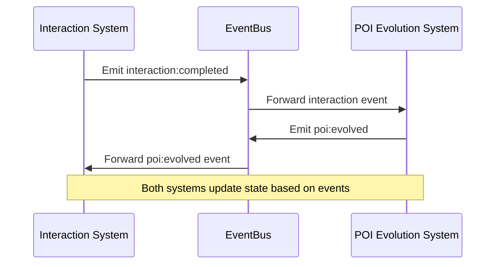

# Data Flow & Event Triggers: Interaction System & POI Evolution System

## Key Data Structures

### InteractionContext (TypeScript interface)
```typescript
export interface InteractionContext {
  npcId: string;
  targetId: string;
  type: InteractionType;
  subtype?: string;
  data?: any;
  location?: string;
  time?: number;
  witnesses?: string[];
  socialContext?: {
    relationship: number;
    groupContext?: {
      groupId: string;
      role: string;
    };
    reputationImpact: number;
    emotionalContext: {
      mood: string;
      intensity: number;
    };
  };
  economicContext?: {
    marketConditions: {
      supply: number;
      demand: number;
    };
    resourceValues: {
      [key: string]: number;
    };
    tradeHistory?: {
      success: number;
      total: number;
    };
  };
}
```

### POIEvolutionEvent (TypeScript interface)
```typescript
export interface POIEvolutionEvent {
  poiId: string;
  previousState: string;
  newState: string;
  triggeredBy: string; // e.g., 'interaction', 'time', 'event'
  timestamp: number;
  context?: InteractionContext;
}
```

## Event Triggers
- `poi:evolved` (emitted by POI Evolution System)
- `interaction:completed` (emitted by Interaction System)
- Other custom events as needed for integration

## Data Validation & Transformation
- All event payloads are validated against their TypeScript interfaces/JSON schemas.
- Data transformation occurs at event boundaries if needed (e.g., mapping internal to external representations).

## Sequence Diagram (Mermaid)


---

See also: API documentation and error handling for payload details. 