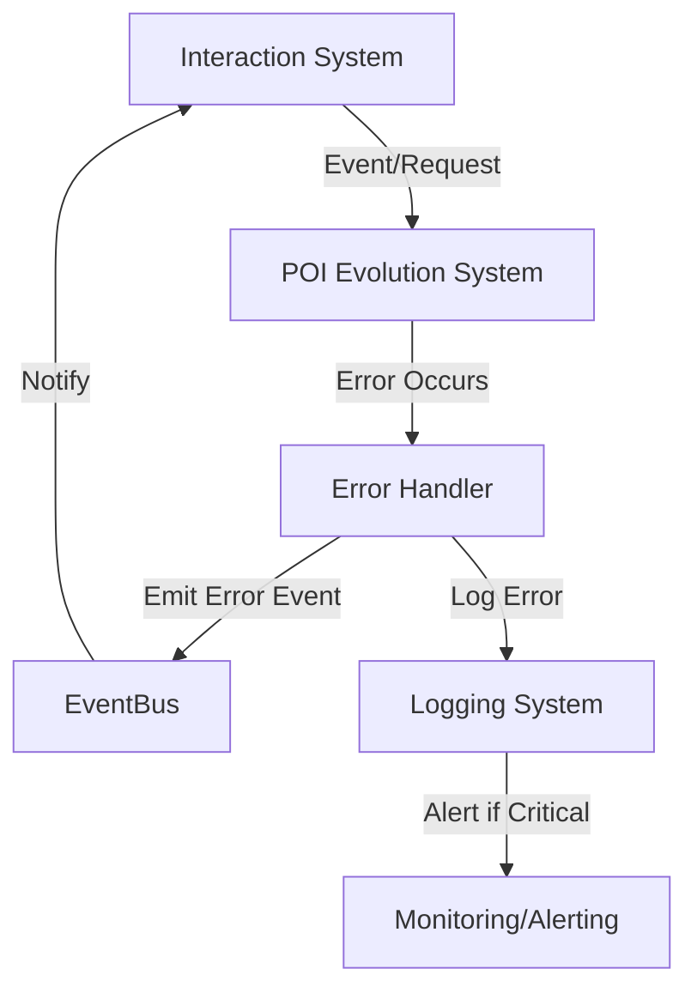

# State Management & Error Handling: Interaction System & POI Evolution System

## State Change Propagation
- Event-driven architecture: state changes are propagated via EventBus events (e.g., 'poi:evolved').
- Asynchronous updates for most operations; synchronous confirmation for critical state changes.
- Transaction boundaries at event emission/consumption; compensating transactions for rollback.

## Conflict Resolution
- Timestamp-based resolution for concurrent updates.
- Merge strategies for partial updates.
- Priority rules: system-initiated changes may override user-initiated changes in some cases.

## Error Handling Framework
- Standardized error codes/messages across all APIs and events.
- HTTP status codes mapped to error scenarios (400, 409, 422, 500, etc.).
- User-facing error messages separated from system logs.
- Error propagation rules for cross-system event handling.

## Logging & Monitoring
- Structured JSON logs with correlation IDs for tracing.
- Log levels: info, warning, error, critical.
- Metrics: event latency, throughput, error rates, cache hit/miss, etc.
- Alerting thresholds for performance degradation.

## Error Propagation Flow (Mermaid)

## Standard Error Codes & Messages
| Code      | HTTP Status | Message                        | Description                        |
|-----------|-------------|--------------------------------|------------------------------------|
| INVALID   | 400         | Invalid request                | Malformed or missing data          |
| NOT_FOUND | 404         | Resource not found             | Entity does not exist              |
| CONFLICT  | 409         | Conflict detected              | Concurrent update or merge failure |
| UNPROCESS | 422         | Unprocessable entity           | Validation failed                  |
| ERROR     | 500         | Internal server error          | Unexpected system error            |
| TIMEOUT   | 504         | Timeout                        | Downstream system unresponsive     |

---

See also: API and data flow documentation for payload and event details. 