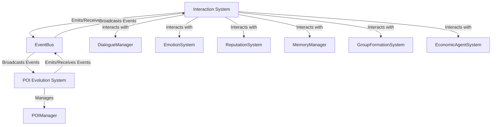

# System Architecture Overview: Interaction System & POI Evolution System

## High-Level Description

The Interaction System manages all NPC-to-NPC and NPC-to-environment interactions, including dialogue, trade, mentoring, conflict resolution, social bonding, information sharing, group decisions, negotiation, deception, cooperation, and competition. It integrates with various subsystems such as DialogueManager, EmotionSystem, ReputationSystem, MemoryManager, GroupFormationSystem, and EconomicAgentSystem.

The POI Evolution System manages the evolution of Points of Interest (POIs) based on game events and player/NPC interactions. It uses rule-based evolution, multiple trigger types (time, event, interaction), and emits events (notably 'poi:evolved') to signal state changes. It integrates with POIManager and uses an event-driven architecture for cross-system communication.

## Integration Points
- EventBus: Used for emitting and subscribing to events such as 'poi:evolved'.
- Shared data models: InteractionContext, POIEvolutionEvent, etc.
- API endpoints for querying and updating POI and interaction data.

## Architecture Diagram (Mermaid)

---

For further details, see the data flow, API, and error handling documentation. 