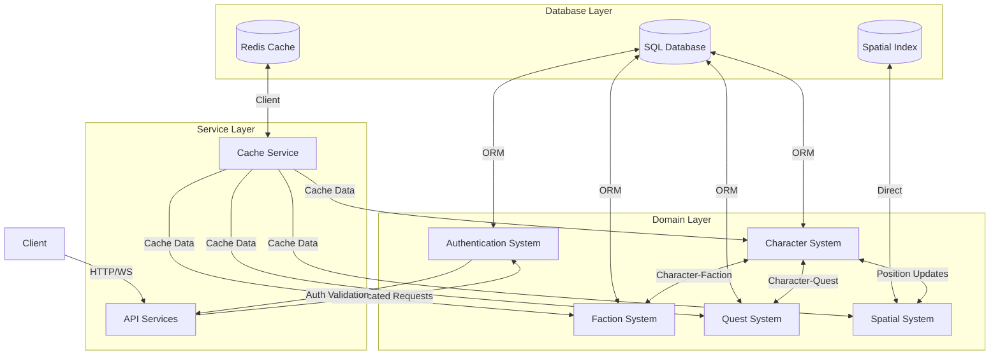

# Data Ownership and Integration Boundaries in the Persistence Layer

## 1. Overview

This document defines the authoritative sources of truth, integration boundaries, and data ownership for all major data domains in the Visual DM persistence layer. It serves as the primary reference for understanding data flow between modules, responsibility boundaries, and conflict resolution strategies.

## 2. Data Domain Mapping

### 2.1 Character Data Domain

| Aspect | Definition |
|--------|------------|
| **Authoritative Source** | SQL Database (`characters` table) |
| **Owner Module** | Character Management System |
| **Description** | Core character data including attributes, race, background, and base statistics |
| **Creation Responsibility** | Character Creation System |
| **Update Responsibility** | Character Management System |
| **Deletion Policy** | Soft delete with 30-day retention before permanent deletion |
| **Archival Policy** | Characters inactive for 1+ year are archived to cold storage |
| **Cache Strategy** | Read-through with 5-minute TTL, write-through for updates |

### 2.2 Faction Data Domain

| Aspect | Definition |
|--------|------------|
| **Authoritative Source** | SQL Database (`factions` table) |
| **Owner Module** | Faction Management System |
| **Description** | Faction metadata, relationships, and hierarchies |
| **Creation Responsibility** | World Generation System |
| **Update Responsibility** | Faction Management System |
| **Deletion Policy** | Soft delete with 30-day retention before permanent deletion |
| **Archival Policy** | None (factions are maintained for world continuity) |
| **Cache Strategy** | Read-through with 15-minute TTL, write-through for updates |

### 2.3 Quest Data Domain

| Aspect | Definition |
|--------|------------|
| **Authoritative Source** | SQL Database (`quests` table) |
| **Owner Module** | Quest Management System |
| **Description** | Quest definitions, objectives, requirements, and rewards |
| **Creation Responsibility** | Quest Generation System |
| **Update Responsibility** | Quest Management System |
| **Deletion Policy** | Soft delete with 30-day retention before permanent deletion |
| **Archival Policy** | Completed quests archived after 90 days of inactivity |
| **Cache Strategy** | Read-through with 10-minute TTL, write-through for updates |

### 2.4 Spatial Data Domain

| Aspect | Definition |
|--------|------------|
| **Authoritative Source** | Spatial Database (RBush-based) |
| **Owner Module** | Spatial Management System |
| **Description** | Spatial indexes and location-based queries for buildings and entities |
| **Creation Responsibility** | World Generation System |
| **Update Responsibility** | Spatial Management System |
| **Deletion Policy** | Immediate deletion when entities are removed |
| **Archival Policy** | None (spatial data is regenerated as needed) |
| **Cache Strategy** | In-memory cache with spatial optimization |

### 2.5 Authentication Data Domain

| Aspect | Definition |
|--------|------------|
| **Authoritative Source** | SQL Database (`users` table) |
| **Owner Module** | Authentication System |
| **Description** | User authentication, permissions, and security credentials |
| **Creation Responsibility** | Authentication System |
| **Update Responsibility** | Authentication System |
| **Deletion Policy** | Soft delete with 90-day retention before permanent deletion |
| **Archival Policy** | Anonymized after 1 year of inactivity |
| **Cache Strategy** | Token-based with Redis, 24-hour expiration |

### 2.6 Cache Data Domain

| Aspect | Definition |
|--------|------------|
| **Authoritative Source** | Redis |
| **Owner Module** | Cache Management System |
| **Description** | Temporary storage for performance optimization |
| **Creation Responsibility** | Multiple Systems (based on caching needs) |
| **Update Responsibility** | Multiple Systems (through Cache Service) |
| **Deletion Policy** | Automatic expiration based on TTL |
| **Archival Policy** | None (ephemeral data) |
| **Cache Strategy** | N/A (is itself a cache) |

## 3. Integration Boundaries Documentation

### 3.1 Character System ↔ Faction System

| Aspect | Definition |
|--------|------------|
| **Integration Type** | Bidirectional, Read/Write |
| **Data Exchange Format** | Internal Object Model |
| **Access Path** | Direct DB access through ORM |
| **Validation Requirements** | Character and Faction IDs must exist and be valid |
| **Auth Requirements** | System-level authorization |
| **Rate Limits** | None (internal system) |
| **Contracts** | Character System may read/update faction membership, Faction System may query member characters |

### 3.2 Character System ↔ Quest System

| Aspect | Definition |
|--------|------------|
| **Integration Type** | Bidirectional, Read/Write |
| **Data Exchange Format** | Internal Object Model |
| **Access Path** | Direct DB access through ORM |
| **Validation Requirements** | Character and Quest IDs must exist and be valid |
| **Auth Requirements** | System-level authorization |
| **Rate Limits** | None (internal system) |
| **Contracts** | Character System may read quest assignments, Quest System may assign quests to characters |

### 3.3 Spatial System ↔ Character System

| Aspect | Definition |
|--------|------------|
| **Integration Type** | Bidirectional, Read/Write |
| **Data Exchange Format** | Position Objects |
| **Access Path** | Direct Memory Access + Event Propagation |
| **Validation Requirements** | Position coordinates must be valid, Entity IDs must exist |
| **Auth Requirements** | System-level authorization |
| **Rate Limits** | None (internal system) |
| **Contracts** | Character System updates positions, Spatial System queries for nearest entities |

### 3.4 Authentication System ↔ Character System

| Aspect | Definition |
|--------|------------|
| **Integration Type** | Unidirectional, Authentication → Character |
| **Data Exchange Format** | Token-based (JWT) |
| **Access Path** | API with token validation |
| **Validation Requirements** | Valid authentication token required |
| **Auth Requirements** | User-level authorization |
| **Rate Limits** | 100 requests per minute per user |
| **Contracts** | Authentication System validates user identity, Character System respects permissions |

### 3.5 Cache System ↔ All Systems

| Aspect | Definition |
|--------|------------|
| **Integration Type** | Bidirectional, Read/Write |
| **Data Exchange Format** | Key-Value Pairs |
| **Access Path** | Redis Client (RedisService) |
| **Validation Requirements** | Valid cache keys, serializable data |
| **Auth Requirements** | System-level authorization |
| **Rate Limits** | None (performance-critical) |
| **Contracts** | Systems may cache data using standard patterns, must respect invalidation schemes |

## 4. Data Flow Visualization

## 5. Consistency and Conflict Resolution

### 5.1 Inter-Domain Consistency Strategy

| Scenario | Strategy |
|----------|----------|
| **Character-Faction Updates** | Transaction-based with database constraints ensuring referential integrity |
| **Character-Quest Updates** | Transaction-based with database constraints ensuring referential integrity |
| **Spatial Position Updates** | Last-writer-wins with timestamp-based versioning |
| **Cache-Database Consistency** | TTL-based expiration with event-driven invalidation for critical updates |

### 5.2 Conflict Resolution Approaches

| Conflict Type | Resolution Strategy |
|--------------|---------------------|
| **Concurrent Character Updates** | Optimistic locking with version field, retry on conflict (max 3 attempts) |
| **Spatial Position Conflicts** | Spatial collision detection with physics-based resolution |
| **Cache Value Conflicts** | Last-writer-wins with timestamp-based versioning |
| **Quest Assignment Conflicts** | Queue-based processing with FIFO ordering |

### 5.3 Eventual Consistency Timeframes

| Data Domain | Consistency Timeframe |
|-------------|----------------------|
| **Character Data** | Immediate consistency for critical fields, 5-minute eventual consistency for derived attributes |
| **Faction Data** | 15-minute eventual consistency |
| **Quest Data** | 10-minute eventual consistency |
| **Spatial Data** | 1-second eventual consistency |
| **Authentication Data** | Immediate consistency |
| **Cache Data** | Varies by TTL (1-minute to 24-hour) |

### 5.4 Cache Invalidation Triggers

| Event | Invalidation Strategy |
|-------|----------------------|
| **Character Update** | Tag-based invalidation for character:${id} and its dependencies |
| **Faction Update** | Tag-based invalidation for faction:${id} and its member list |
| **Quest Update** | Tag-based invalidation for quest:${id} and character quest lists |
| **Spatial Update** | Spatial radius invalidation for affected area |
| **Authentication Change** | Immediate token invalidation |

## 6. Access Control and Permissions

### 6.1 Module Access Permissions

| Module | Read Access | Write Access |
|--------|-------------|--------------|
| **Character System** | Character, Faction (members), Quest (assignments) | Character |
| **Faction System** | Faction, Character (members) | Faction, Character-Faction relationships |
| **Quest System** | Quest, Character (quest assignments) | Quest, Character-Quest relationships |
| **Spatial System** | Spatial Index, Character (position) | Spatial Index |
| **Authentication System** | Authentication Data | Authentication Data |
| **Cache System** | All cached data | All cached data |

### 6.2 Authentication Requirements

| Boundary | Auth Requirement |
|----------|------------------|
| **API ↔ Service Layer** | Valid JWT token with role-based permissions |
| **Service ↔ Domain Layer** | System-level authorization with service credentials |
| **Domain ↔ Database Layer** | Database credentials with limited-privilege accounts |

### 6.3 Audit Logging Requirements

| Operation Type | Logging Requirement |
|----------------|---------------------|
| **Read Operations** | No logging for standard reads, logging for sensitive data access |
| **Write Operations** | All write operations logged with user/system ID, timestamp, and changed fields |
| **Delete Operations** | All delete operations logged with user/system ID, timestamp, and affected records |
| **Authentication Events** | All authentication attempts (success/failure) logged with IP, timestamp, and user ID |

## 7. Data Ownership Maintenance

This document will be reviewed quarterly by the architecture team to ensure it remains accurate and up-to-date. Any proposed changes to data ownership or integration boundaries must be approved through the change management process.

Version: 1.0  
Last Updated: [Current Date]  
Next Review: [Current Date + 3 months] 