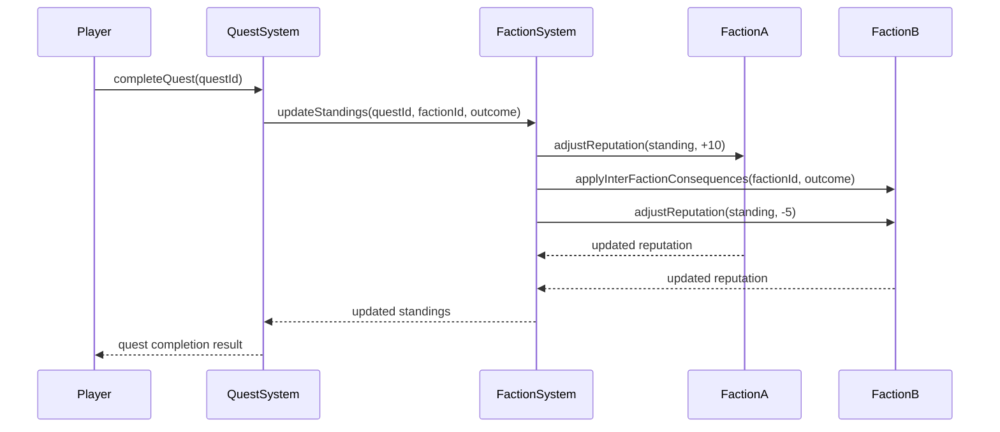
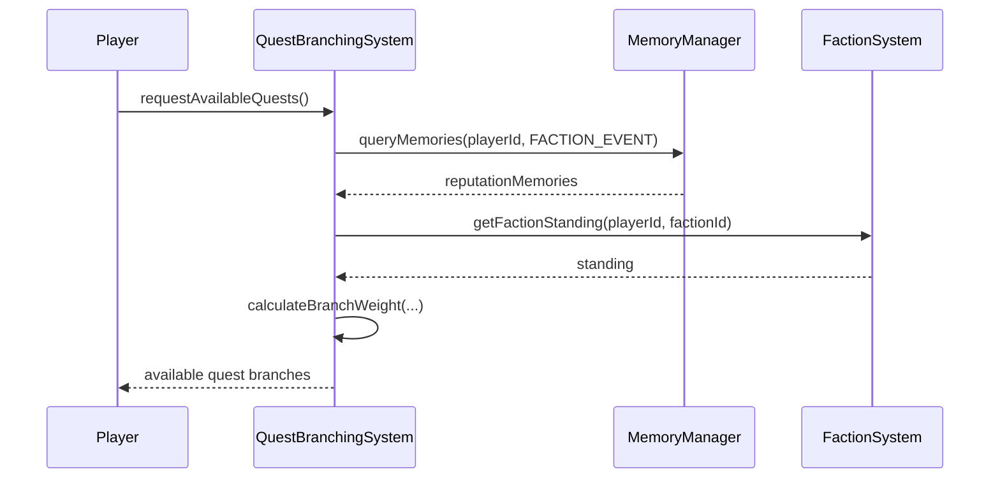
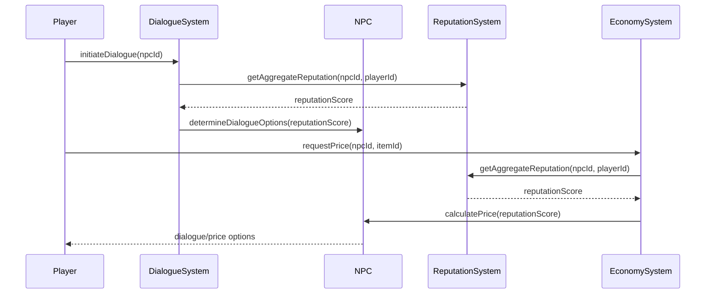
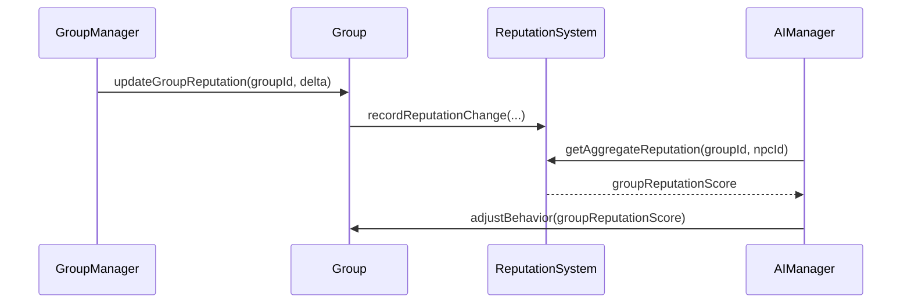
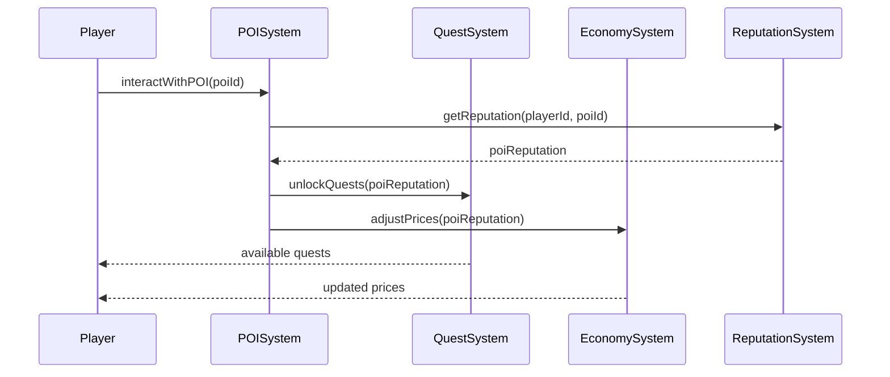

# Reputation System Complex Interaction Sequence Diagrams

This document contains Mermaid sequence diagrams illustrating the flow of reputation data across multiple game systems for key complex scenarios.

---

## 1. Reputation Change Propagation Through Factions

---

## 2. Reputation-Based Quest Unlocking

---

## 3. Reputation Effects on Dialogue and Merchant Pricing

---

## 4. Group Reputation Affecting AI Behavior

---

## 5. POI Reputation Influencing Quest and Economy Systems

---

# End of Diagrams 