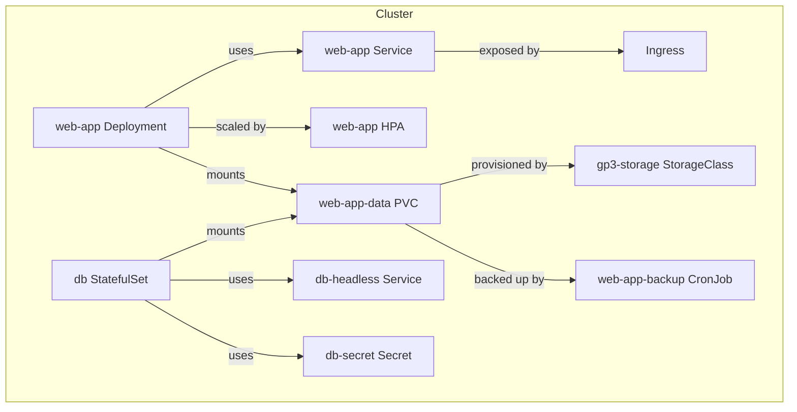

# Kubernetes Orchestration for Visual_DM

## Overview
This directory contains Kubernetes manifests for deploying, scaling, and managing the Visual_DM application and its supporting infrastructure using industry best practices.

## Architecture Diagram



## Manifests
- `hpa.yaml`: Horizontal Pod Autoscaler for web-app
- `storageclass.yaml`: StorageClass for dynamic EBS provisioning
- `pvc.yaml`: PersistentVolumeClaim for app data
- `backup-job.yaml`: CronJob for daily backups
- `statefulset.yaml`: StatefulSet for PostgreSQL with headless service
- `db-secret.yaml`: Secret for database password

## Deployment Steps
1. **Create Namespace (if needed):**
   ```sh
   kubectl create namespace default # or your chosen namespace
   ```
2. **Apply StorageClass:**
   ```sh
   kubectl apply -f k8s/storageclass.yaml
   ```
3. **Apply PersistentVolumeClaim:**
   ```sh
   kubectl apply -f k8s/pvc.yaml
   ```
4. **Apply Secret:**
   ```sh
   kubectl apply -f k8s/db-secret.yaml
   ```
5. **Apply StatefulSet and Headless Service:**
   ```sh
   kubectl apply -f k8s/statefulset.yaml
   ```
6. **Apply HPA:**
   ```sh
   kubectl apply -f k8s/hpa.yaml
   ```
7. **Apply Backup CronJob:**
   ```sh
   kubectl apply -f k8s/backup-job.yaml
   ```

## Best Practices
- Use `gp3-storage` for cost-effective, performant EBS volumes.
- All sensitive data is managed via Kubernetes Secrets.
- HPA is configured for CPU scaling; adjust metrics as needed.
- Backups are performed daily; update the backup job for your cloud provider.
- StatefulSets are used for databases to ensure stable network identity and storage.

## Disaster Recovery & Runbook
- **Restore from Backup:**
  - Extract the latest backup from the backup location (e.g., S3).
  - Restore data to the PVC by running a job that mounts the PVC and untars the backup.
- **Scaling:**
  - Adjust `replicas` in StatefulSet or HPA limits as needed.
- **CI/CD:**
  - Store manifests in version control.
  - Use GitOps tools (e.g., ArgoCD, Flux) to automate deployment.
  - Validate manifests with `kubectl apply --dry-run=client` and `kubeval`.

## Notes
- Update image tags and resource requests/limits for your workload.
- For production, use a dedicated namespace and enable RBAC.
- Consider Helm for templating and managing complex deployments. 